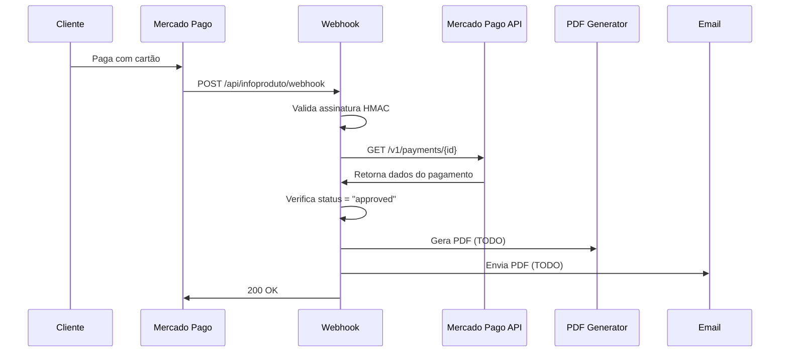

# 🔔 Como Configurar Webhook do Mercado Pago

## ✅ O Que Já Foi Feito

1. ✅ **Endpoint webhook criado**: `/api/infoproduto/webhook`
2. ✅ **Validação de assinatura implementada**: HMAC SHA256
3. ✅ **Consulta de pagamento**: Busca detalhes na API do MP
4. ✅ **Retorna 200 OK**: Confirma recebimento
5. ✅ **URL configurada na preferência**: `notification_url`

---

## 📋 O Que Você Precisa Configurar

### 1️⃣ Acessar o Painel do Mercado Pago

1. Acesse: https://www.mercadopago.com.br/developers/panel/app
2. Selecione sua aplicação
3. No menu lateral, clique em **"Webhooks"**
4. Clique em **"Configurar notificações"**

---

### 2️⃣ Configurar URL do Webhook

**Aba "Modo produtivo":**

**URL para notificações:**
```
https://atma.roilabs.com.br/api/infoproduto/webhook
```

⚠️ **IMPORTANTE**: A URL **DEVE** ser HTTPS (não HTTP)

---

### 3️⃣ Selecionar Eventos

Marque a opção:
- ✅ **Pagamentos** (payment events)

Isso enviará notificações quando:
- Um pagamento for criado
- Um pagamento mudar de status (pending → approved)
- Um pagamento for rejeitado

---

### 4️⃣ Salvar e Copiar Chave Secreta

1. Clique em **"Salvar configuração"**
2. O Mercado Pago gerará uma **chave secreta**
3. **COPIE ESSA CHAVE** (você vai precisar dela)

Exemplo de chave secreta:
```
abc123def456ghi789jkl012mno345pqr678stu901vwx234yz
```

---

### 5️⃣ Adicionar Chave no Vercel

1. Acesse seu projeto no Vercel
2. Vá em **Settings → Environment Variables**
3. Adicione uma **nova variável**:

```
Nome: MERCADOPAGO_WEBHOOK_SECRET
Valor: [cole a chave secreta aqui]
```

4. **Redeploy** o projeto

---

### 6️⃣ Testar o Webhook

**Dentro do painel de Webhooks do Mercado Pago:**

1. Clique em **"Simular"**
2. Selecione a **URL de produção**
3. Selecione evento: **"payment"**
4. Insira um **Data ID** de teste (ex: `123456`)
5. Clique em **"Enviar teste"**

**Você verá:**
- ✅ Solicitação enviada
- ✅ Resposta do servidor (200 OK)
- ✅ Body da notificação

---

## 🔍 Como Funciona



---

## 📊 Logs do Webhook

Quando um pagamento for feito, você verá nos logs do Vercel:

```
🔔 Webhook recebido: {
  type: "payment",
  dataId: "123456789",
  xRequestId: "abc-def-ghi",
  hasSignature: true,
  body: {...}
}

💳 Consultando pagamento: 123456789

📊 Status do pagamento: {
  id: 123456789,
  status: "approved",
  status_detail: "accredited",
  email: "cliente@email.com",
  external_reference: "relatorio-1732123456789-cliente@email.com"
}

✅ Pagamento aprovado! Gerando PDF para: cliente@email.com
```

---

## ⚠️ Importante sobre Duplicação

O Mercado Pago pode enviar a mesma notificação **múltiplas vezes**:
- Tentativa 1: Imediata
- Tentativa 2: +15 minutos
- Tentativa 3: +30 minutos
- Tentativa 4: +6 horas
- E assim por diante...

**Solução**: Implementar controle de duplicação

### Opções:

**1. Usar banco de dados:**
```typescript
// Verificar se já processou
const jaProcessado = await db.payments.findOne({
  where: { paymentId: paymentData.id }
})

if (jaProcessado) {
  return NextResponse.json({ success: true, already_processed: true })
}

// Processar PDF...

// Marcar como processado
await db.payments.create({
  paymentId: paymentData.id,
  processedAt: new Date()
})
```

**2. Usar cache (Redis/Vercel KV):**
```typescript
// Verificar cache
const cacheKey = `payment-processed-${paymentId}`
const cached = await kv.get(cacheKey)

if (cached) {
  return NextResponse.json({ success: true, already_processed: true })
}

// Processar PDF...

// Salvar no cache (expira em 7 dias)
await kv.set(cacheKey, true, { ex: 604800 })
```

---

## 🎯 Próximos Passos

1. ✅ Configurar webhook no painel MP
2. ✅ Adicionar `MERCADOPAGO_WEBHOOK_SECRET` no Vercel
3. ✅ Testar simulação de webhook
4. ⏳ Implementar geração de PDF via webhook
5. ⏳ Implementar controle de duplicação

---

## 📖 Referências

- [Configurar Webhooks - Mercado Pago](https://www.mercadopago.com.br/developers/pt/docs/your-integrations/notifications/webhooks)
- [Validar origem da notificação](https://www.mercadopago.com.br/developers/pt/docs/your-integrations/notifications/webhooks#validate-origin)

---

**Quer que eu te ajude a configurar o webhook agora?**
