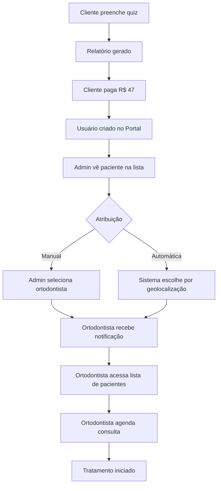

# 🦷 Fluxo de Atribuição de Paciente a Dentista/Ortodontista - Sistema Atma

## 📋 Visão Geral do Sistema

O Sistema Atma possui **2 plataformas distintas**:

1. **Portal do Paciente** (`/Frontend`) - Onde os pacientes acessam seus relatórios
2. **Painel Admin** (`/admin`) - Onde a equipe Atma gerencia ortodontistas e pacientes

---

## 🔄 Fluxo Completo: Do Lead ao Tratamento

### **Fase 1: Captação do Lead** 📝

#### 1.1. Cliente preenche o quiz/formulário
- **Local**: Site público (`/infoproduto/relatorio-viabilidade`)
- **Dados coletados**:
  - Nome completo
  - Email
  - Telefone
  - Problemas ortodônticos
  - Fotos/moldagens (opcional)

#### 1.2. Relatório de Viabilidade gerado
- **Sistema calcula**:
  - Score de viabilidade (0-100)
  - Complexidade (Simples/Moderada/Complexa)
  - Duração estimada
  - Custo estimado
- **Tabelas envolvidas**:
  - `clientes` - dados do cliente
  - `relatorios` - análise de viabilidade
  - `atividades` - log "relatorio_gerado"

---

### **Fase 2: Pagamento e Acesso ao Portal** 💳

#### 2.1. Cliente paga R$ 47 (ou valor configurado)
- **Webhook Mercado Pago** (`/api/infoproduto/webhook`)
- **Ação**: Cria usuário no Portal do Paciente

#### 2.2. Usuário criado via Clerk
- **Webhook Clerk** → Sincroniza com banco
- **Tabelas**:
  - `portal_users` - usuário do portal
  - `portal_relatorios` - relatório vinculado ao usuário
  - `portal_preferencias` - configurações

---

### **Fase 3: Gestão no Painel Admin** 👨‍💼

#### 3.1. Visualização de Pacientes
**Local**: `/admin/pacientes/lista`

**Informações exibidas**:
```typescript
interface Patient {
  id: number
  name: string
  email: string
  phone: string
  cpf: string
  status: string // "novo", "em_analise", "ativo", etc
  treatmentStage: string // estágio do tratamento
  orthodontist: string // ← ORTODONTISTA ATRIBUÍDO
  registrationDate: string
  cidade: string
  observacoes: string
}
```

**Status possíveis**:
- `novo` - Acabou de se cadastrar
- `em_analise` - Relatório sendo analisado
- `aguardando_consulta` - Aguardando agendamento
- `consulta_agendada` - Consulta marcada
- `em_tratamento` - Tratamento iniciado
- `concluido` - Tratamento finalizado
- `cancelado` - Cancelado

#### 3.2. Gestão de Ortodontistas
**Local**: `/admin/ortodontistas`

**Informações exibidas**:
```typescript
interface Orthodontist {
  id: number
  name: string // "Dr. João Santos"
  email: string
  phone: string
  cro: string // "CRO-SP 12345"
  specialty: string
  city: string
  state: string
  status: string // "Ativo", "Pendente", "Inativo"
  patientsCount: number // ← NÚMERO DE PACIENTES
  rating: number // Avaliação (0-5)
  partnershipModel: string // "Premium" ou "Standard"
}
```

---

## ⚠️ **PROBLEMA IDENTIFICADO: ATRIBUIÇÃO NÃO IMPLEMENTADA**

### ❌ O que está faltando

**Atualmente NÃO EXISTE** um fluxo implementado para:
1. Atribuir/vincular um paciente a um ortodontista específico
2. Interface para fazer essa atribuição
3. Campo `orthodontist_id` nas tabelas de pacientes

### 📊 Estrutura Atual das Tabelas

#### Tabela `clientes` (CRM do infoproduto)
```sql
CREATE TABLE clientes (
  id INT PRIMARY KEY,
  nome VARCHAR(255),
  email VARCHAR(255),
  telefone VARCHAR(20),
  cidade VARCHAR(100),
  estado VARCHAR(2)
  -- ❌ NÃO TEM: orthodontist_id
)
```

#### Tabela `portal_users` (Portal do Paciente)
```sql
CREATE TABLE portal_users (
  id INT PRIMARY KEY,
  clerk_user_id VARCHAR(255),
  email VARCHAR(255),
  nome VARCHAR(255),
  telefone VARCHAR(20)
  -- ❌ NÃO TEM: orthodontist_id
)
```

#### Tabela `tratamentos` (ÚNICA que tem referência)
```sql
CREATE TABLE tratamentos (
  id INT PRIMARY KEY,
  cliente_id INT,

  -- ✅ TEM campos do ortodontista (mas como STRING, não FK):
  ortodontista_nome VARCHAR(255),
  ortodontista_email VARCHAR(255),
  ortodontista_telefone VARCHAR(20),

  -- Mas NÃO TEM:
  -- orthodontist_id INT FOREIGN KEY
)
```

---

## ✅ **SOLUÇÃO: Como Implementar o Fluxo de Atribuição**

### **Opção 1: Atribuição Manual no Admin** (Recomendado para MVP)

#### Passo 1: Adicionar campo `orthodontist_id` nas tabelas

**Migration SQL**:
```sql
-- 1. Criar tabela de ortodontistas (se não existir)
CREATE TABLE IF NOT EXISTS ortodontistas (
  id INT AUTO_INCREMENT PRIMARY KEY,
  nome VARCHAR(255) NOT NULL,
  email VARCHAR(255) NOT NULL UNIQUE,
  cro VARCHAR(50) NOT NULL UNIQUE,
  telefone VARCHAR(20),
  cidade VARCHAR(100),
  estado VARCHAR(2),
  status ENUM('ativo', 'inativo', 'pendente') DEFAULT 'ativo',
  capacidade_mensal INT DEFAULT 10,
  modelo_parceria ENUM('atma-aligner', 'premium') DEFAULT 'atma-aligner',
  created_at TIMESTAMP DEFAULT CURRENT_TIMESTAMP,
  updated_at TIMESTAMP DEFAULT CURRENT_TIMESTAMP ON UPDATE CURRENT_TIMESTAMP,

  INDEX idx_email (email),
  INDEX idx_cro (cro),
  INDEX idx_status (status)
);

-- 2. Adicionar FK em portal_users
ALTER TABLE portal_users
ADD COLUMN orthodontist_id INT NULL,
ADD FOREIGN KEY (orthodontist_id) REFERENCES ortodontistas(id) ON DELETE SET NULL;

-- 3. Adicionar FK em clientes (CRM)
ALTER TABLE clientes
ADD COLUMN orthodontist_id INT NULL,
ADD FOREIGN KEY (orthodontist_id) REFERENCES ortodontistas(id) ON DELETE SET NULL;

-- 4. Adicionar FK em tratamentos
ALTER TABLE tratamentos
ADD COLUMN orthodontist_id INT NULL,
ADD FOREIGN KEY (orthodontist_id) REFERENCES ortodontistas(id) ON DELETE SET NULL;
```

#### Passo 2: Atualizar Interface Admin

**Em `/admin/pacientes/lista/page.tsx`**, adicionar:

```typescript
// 1. Adicionar botão "Atribuir Ortodontista" em cada linha da tabela
<Button
  variant="ghost"
  size="sm"
  onClick={() => handleAssignOrthodontist(patient)}
>
  <UserPlus className="h-4 w-4 mr-1" />
  Atribuir
</Button>

// 2. Modal de atribuição
const AssignOrthodontistModal = ({ patient, orthodontists, onAssign }) => {
  const [selectedOrthodontistId, setSelectedOrthodontistId] = useState<number | null>(null)

  return (
    <Dialog>
      <DialogHeader>
        <DialogTitle>Atribuir Ortodontista</DialogTitle>
        <DialogDescription>
          Selecione o ortodontista responsável por {patient.name}
        </DialogDescription>
      </DialogHeader>

      <Select onValueChange={(value) => setSelectedOrthodontistId(parseInt(value))}>
        <SelectTrigger>
          <SelectValue placeholder="Selecione um ortodontista" />
        </SelectTrigger>
        <SelectContent>
          {orthodontists.map(ortho => (
            <SelectItem key={ortho.id} value={ortho.id.toString()}>
              {ortho.name} - {ortho.city}/{ortho.state}
              <Badge>{ortho.patientsCount} pacientes</Badge>
            </SelectItem>
          ))}
        </SelectContent>
      </Select>

      <Button onClick={() => onAssign(patient.id, selectedOrthodontistId)}>
        Confirmar Atribuição
      </Button>
    </Dialog>
  )
}

// 3. Função de atribuição
const handleAssignOrthodontist = async (patientId: number, orthodontistId: number) => {
  try {
    await apiService.assignOrthodontist({
      patientId,
      orthodontistId
    })

    toast({
      title: "Ortodontista atribuído!",
      description: "O paciente foi vinculado ao ortodontista com sucesso"
    })

    refetch() // Recarregar lista
  } catch (error) {
    toast({
      title: "Erro",
      description: "Não foi possível atribuir o ortodontista",
      variant: "destructive"
    })
  }
}
```

#### Passo 3: Criar API Endpoint

**Arquivo**: `/admin/api/patients/assign-orthodontist/route.ts`

```typescript
import { NextRequest, NextResponse } from 'next/server'
import { query } from '@/lib/db'

export async function POST(req: NextRequest) {
  try {
    const { patientId, orthodontistId } = await req.json()

    // Validar
    if (!patientId || !orthodontistId) {
      return NextResponse.json(
        { error: 'patientId e orthodontistId são obrigatórios' },
        { status: 400 }
      )
    }

    // Atribuir ortodontista ao paciente
    await query(
      `UPDATE portal_users
       SET orthodontist_id = ?, updated_at = NOW()
       WHERE id = ?`,
      [orthodontistId, patientId]
    )

    // Registrar atividade
    await query(
      `INSERT INTO atividades (cliente_id, tipo, descricao, created_at)
       VALUES (?, 'ortodontista_atribuido', ?, NOW())`,
      [patientId, `Ortodontista ID ${orthodontistId} atribuído ao paciente`]
    )

    // Atualizar contador de pacientes do ortodontista
    await query(
      `UPDATE ortodontistas
       SET updated_at = NOW()
       WHERE id = ?`,
      [orthodontistId]
    )

    return NextResponse.json({
      success: true,
      message: 'Ortodontista atribuído com sucesso'
    })

  } catch (error) {
    console.error('Erro ao atribuir ortodontista:', error)
    return NextResponse.json(
      { error: 'Erro ao atribuir ortodontista' },
      { status: 500 }
    )
  }
}
```

---

### **Opção 2: Atribuição Automática por Geolocalização** (Avançado)

#### Algoritmo de atribuição automática:

```typescript
async function autoAssignOrthodontist(patientId: number) {
  // 1. Buscar dados do paciente
  const patient = await query(
    'SELECT * FROM portal_users WHERE id = ?',
    [patientId]
  )

  // 2. Buscar ortodontistas da mesma cidade/estado
  const orthodontists = await query(
    `SELECT * FROM ortodontistas
     WHERE cidade = ? AND estado = ? AND status = 'ativo'
     ORDER BY (
       SELECT COUNT(*) FROM portal_users
       WHERE orthodontist_id = ortodontistas.id
     ) ASC
     LIMIT 1`,
    [patient.cidade, patient.estado]
  )

  // 3. Atribuir ao ortodontista com menos pacientes
  if (orthodontists.length > 0) {
    await query(
      'UPDATE portal_users SET orthodontist_id = ? WHERE id = ?',
      [orthodontists[0].id, patientId]
    )

    return orthodontists[0]
  }

  return null
}
```

---

### **Opção 3: Sistema de Distribuição Round-Robin**

```typescript
async function roundRobinAssignment(patientId: number) {
  // Buscar próximo ortodontista na fila
  const nextOrthodontist = await query(
    `SELECT id FROM ortodontistas
     WHERE status = 'ativo'
     ORDER BY last_assignment_at ASC
     LIMIT 1`
  )

  // Atribuir e atualizar timestamp
  await query(
    `UPDATE ortodontistas
     SET last_assignment_at = NOW()
     WHERE id = ?`,
    [nextOrthodontist[0].id]
  )

  await query(
    'UPDATE portal_users SET orthodontist_id = ? WHERE id = ?',
    [nextOrthodontist[0].id, patientId]
  )
}
```

---

## 📊 Dashboard de Ortodontistas

### Visualização de Pacientes Atribuídos

**Local**: `/admin/ortodontistas/{id}/pacientes`

```typescript
// Listar pacientes de um ortodontista específico
const OrthodontistPatientsPage = ({ orthodontistId }) => {
  const patients = await query(
    `SELECT u.*, r.score, r.status
     FROM portal_users u
     LEFT JOIN portal_relatorios r ON u.id = r.user_id
     WHERE u.orthodontist_id = ?
     ORDER BY r.created_at DESC`,
    [orthodontistId]
  )

  return (
    <div>
      <h1>Pacientes do Dr. {orthodontist.name}</h1>
      <Table>
        {patients.map(patient => (
          <TableRow>
            <TableCell>{patient.nome}</TableCell>
            <TableCell>{patient.score}/100</TableCell>
            <TableCell>{patient.status}</TableCell>
          </TableRow>
        ))}
      </Table>
    </div>
  )
}
```

---

## 🔔 Notificações

### Email ao Ortodontista quando paciente é atribuído

```typescript
// Enviar email via Resend
await enviarEmail({
  to: orthodontist.email,
  subject: '🦷 Novo Paciente Atribuído - Atma',
  html: renderTemplate(
    <EmailNovoPaciente
      orthodontist={orthodontist}
      patient={patient}
      report={report}
    />
  )
})
```

---

## 📈 Métricas e Relatórios

### Queries úteis:

```sql
-- 1. Ortodontistas com mais pacientes
SELECT o.nome, o.cidade, COUNT(u.id) as total_pacientes
FROM ortodontistas o
LEFT JOIN portal_users u ON o.id = u.orthodontist_id
GROUP BY o.id
ORDER BY total_pacientes DESC;

-- 2. Pacientes sem ortodontista atribuído
SELECT nome, email, created_at
FROM portal_users
WHERE orthodontist_id IS NULL
ORDER BY created_at DESC;

-- 3. Taxa de conversão por ortodontista
SELECT
  o.nome,
  COUNT(DISTINCT u.id) as total_pacientes,
  COUNT(DISTINCT CASE WHEN r.status = 'em_tratamento' THEN u.id END) as em_tratamento,
  ROUND(COUNT(DISTINCT CASE WHEN r.status = 'em_tratamento' THEN u.id END) / COUNT(DISTINCT u.id) * 100, 2) as taxa_conversao
FROM ortodontistas o
LEFT JOIN portal_users u ON o.id = u.orthodontist_id
LEFT JOIN portal_relatorios r ON u.id = r.user_id
GROUP BY o.id;
```

---

## ✅ Resumo do Fluxo Completo



---

## 🚀 Próximos Passos para Implementar

1. **Criar migration SQL** para adicionar `orthodontist_id`
2. **Adicionar botão "Atribuir"** na lista de pacientes
3. **Criar modal de seleção** de ortodontista
4. **Implementar API endpoint** `/api/patients/assign-orthodontist`
5. **Adicionar notificação por email** ao ortodontista
6. **Criar página de pacientes** do ortodontista
7. **Dashboard de métricas** por ortodontista

**Quer que eu implemente alguma dessas funcionalidades agora?** 🤔
