# 🎯 Funil de Vendas - Sistema Atma Admin

## 📊 Visão Geral

O **Atma Admin** (https://atmaadmin.roilabs.com.br) possui um **funil de vendas completo** para gerenciar pacientes desde o primeiro contato até o tratamento ortodôntico.

---

## 🔄 Etapas do Funil (Status)

O sistema utiliza **7 status** para rastrear a jornada do paciente:

### 1️⃣ **Novo** (`novo`)
- **Descrição**: Lead recém-cadastrado no sistema
- **Badge**: Azul
- **Ação**: Fazer primeiro contato (telefone/email/WhatsApp)

### 2️⃣ **Contatado** (`contatado`)
- **Descrição**: Equipe já fez o primeiro contato e qualificou o lead
- **Badge**: Amarelo
- **Ação**: **⚠️ ATRIBUIR ORTODONTISTA e AGENDAR CONSULTA**

### 3️⃣ **Agendado** (`agendado`)
- **Descrição**: Consulta de avaliação agendada **com ortodontista específico**
- **Badge**: Roxo
- **Ortodontista**: Já foi atribuído nesta etapa
- **Ação**: Confirmar presença e enviar lembretes

### 4️⃣ **Avaliação Inicial** (`avaliacao_inicial`)
- **Descrição**: Paciente compareceu à consulta e foi avaliado pelo ortodontista
- **Badge**: Índigo
- **Ação**: Ortodontista apresenta plano de tratamento e orçamento

### 5️⃣ **Atribuído** (`atribuido`)
- **Descrição**: Paciente aceitou o plano e está "em tratamento" com ortodontista
- **Badge**: Laranja (Em Tratamento)
- **Ação**: Acompanhar progresso e próximas consultas

### 6️⃣ **Convertido** (`convertido`)
- **Descrição**: Tratamento ortodôntico concluído (paciente finalizou)
- **Badge**: Verde esmeralda
- **Ação**: Follow-up pós-tratamento e manutenção

### 7️⃣ **Cancelado** (`cancelado`)
- **Descrição**: Lead/paciente desistiu ou foi desqualificado em qualquer etapa
- **Badge**: Cinza
- **Ação**: Registrar motivo da desistência para análise

---

## 🗂️ Onde Visualizar o Funil

### 📋 **Lista de Pacientes** (Visão Tabular)
**URL**: `/admin/pacientes/lista`

**Arquivo**: `admin/src/app/admin/pacientes/lista/page.tsx`

**Recursos**:
- Busca por nome, email ou CPF
- Filtro por **status** (dropdown)
- Filtro por **data de cadastro** (intervalo de datas)
- Exibe colunas:
  - Nome
  - Email
  - CPF
  - **Status** (badge colorido)
  - Data Cadastro (SP timezone)
  - **Etapa do Tratamento** (`treatmentStage`)
  - **Ortodontista** (`orthodontist`)
- Ações: Visualizar, Editar, Cancelar, Excluir

**Código dos Status**:
```typescript
// admin/src/app/admin/pacientes/lista/page.tsx:308-327
const getStatusBadge = (status: string) => {
  switch (status) {
    case 'novo':
      return <Badge className="bg-blue-100 text-blue-800">Novo</Badge>
    case 'contatado':
      return <Badge className="bg-yellow-100 text-yellow-800">Contatado</Badge>
    case 'agendado':
      return <Badge className="bg-purple-100 text-purple-800">Agendado</Badge>
    case 'avaliacao_inicial':
      return <Badge className="bg-indigo-100 text-indigo-800">Avaliação Inicial</Badge>
    case 'atribuido':
      return <Badge className="bg-green-100 text-green-800">Em Tratamento</Badge>
    case 'convertido':
      return <Badge className="bg-emerald-100 text-emerald-800">Convertido</Badge>
    case 'cancelado':
      return <Badge className="bg-orange-100 text-orange-800">Cancelado</Badge>
  }
}
```

---

### 🎴 **Kanban de Pacientes** (Drag & Drop)
**URL**: `/admin/pacientes/kanban`

**Arquivo**: `admin/src/app/admin/pacientes/kanban/page.tsx`

**Recursos**:
- **6 colunas** visuais representando cada etapa do funil
- **Drag & Drop** para mover pacientes entre colunas
- **Atualização otimista** usando React 19's `useOptimistic`
- Cards com informações resumidas:
  - Avatar com iniciais
  - Nome e email
  - Telefone (se disponível)
  - Ortodontista (se atribuído)
  - CPF
- Menu de ações rápidas:
  - Ligar (abre discador do telefone)
  - Enviar email (abre Gmail/Outlook)
  - Excluir paciente

**Estrutura das Colunas**:
```typescript
// admin/src/app/admin/pacientes/kanban/page.tsx:58-101
const columns = [
  {
    id: 'novo',
    title: 'Novos',
    color: 'bg-blue-50 border-blue-200',
    count: patients.filter(p => p.status === 'novo').length,
    patients: patients.filter(p => p.status === 'novo')
  },
  {
    id: 'contatado',
    title: 'Contatados',
    color: 'bg-yellow-50 border-yellow-200',
    count: patients.filter(p => p.status === 'contatado').length,
    patients: patients.filter(p => p.status === 'contatado')
  },
  {
    id: 'agendado',
    title: 'Agendados',
    color: 'bg-purple-50 border-purple-200',
    count: patients.filter(p => p.status === 'agendado').length,
    patients: patients.filter(p => p.status === 'agendado')
  },
  {
    id: 'avaliacao_inicial',
    title: 'Avaliação Inicial',
    color: 'bg-indigo-50 border-indigo-200',
    count: 0, // Placeholder
    patients: []
  },
  {
    id: 'atribuido',
    title: 'Em Tratamento',
    color: 'bg-orange-50 border-orange-200',
    count: patients.filter(p => p.status === 'atribuido').length,
    patients: patients.filter(p => p.status === 'atribuido')
  },
  {
    id: 'convertido',
    title: 'Concluídos',
    color: 'bg-green-50 border-green-200',
    count: patients.filter(p => p.status === 'convertido').length,
    patients: patients.filter(p => p.status === 'convertido')
  }
]
```

**Drag & Drop com Atualização Otimista**:
```typescript
// admin/src/app/admin/pacientes/kanban/page.tsx:144-179
const handleDrop = async (e: React.DragEvent, targetStatus: string) => {
  if (!draggedPatient || draggedPatient.status === targetStatus) {
    return
  }

  // Atualização otimista (UI responde instantaneamente)
  updateOptimisticPatients({ patientId: draggedPatient.id, newStatus: targetStatus })

  try {
    // Atualiza no backend
    await apiService.updatePatient(draggedPatient.id.toString(), {
      status: targetStatus
    })

    toast({
      title: 'Status atualizado',
      description: `Paciente movido para ${getStatusLabel(targetStatus)}`,
    })

    // Refaz a busca para garantir consistência
    await refetch()
  } catch (error) {
    toast({
      title: 'Erro',
      description: 'Erro ao atualizar status do paciente',
      variant: 'destructive'
    })
    // Reverte a atualização otimista em caso de erro
    await refetch()
  }

  setDraggedPatient(null)
}
```

---

### 📈 **BI de Conversão** (Visualização do Funil)
**URL**: `/admin/bi-conversao`

**Arquivo**: `admin/src/components/funnel/FunnelFlowVisualization.tsx`

**Recursos**:
- **Visualização interativa** usando ReactFlow
- **Fluxograma completo** do funil:
  - Impressões Google → Cliques → Cadastros → Status CRM
- **Métricas de conversão** entre cada etapa:
  - CTR (Click-Through Rate)
  - Taxa de Conversão de Cadastro
  - Taxa de Contato
  - Taxa de Agendamento
  - Taxa de Comparecimento
  - Taxa de Atribuição
  - Taxa de Conversão Final
- **Tooltips informativos** com:
  - Fórmula de cálculo
  - Numerador e denominador
  - Meta de desempenho
- **Cores dinâmicas**:
  - 🟢 Verde: Meta atingida
  - 🟡 Amarelo: Performance aceitável
  - 🔴 Vermelho: Abaixo da meta

**Estrutura do Fluxo**:
```typescript
// admin/src/components/funnel/FunnelFlowVisualization.tsx:154-394
const nodes = [
  // Linha 1: Topo do Funil (Aquisição)
  { id: 'impressoes', label: 'IMPRESSÕES', count: metrics.seo.impressions },
  { id: 'cliques', label: 'CLIQUES', count: metrics.seo.clicks },
  { id: 'cadastros', label: 'CADASTROS', count: metrics.crm.registrations },

  // Linha 1 continuação: Início do CRM
  { id: 'novo', label: 'NOVO', count: metrics.crm.statusBreakdown.novo },
  { id: 'contatado', label: 'CONTATADO', count: metrics.crm.statusBreakdown.contatado },

  // Linha 2: Progressão até Conversão
  { id: 'agendado', label: 'AGENDADO', count: metrics.crm.statusBreakdown.agendado },
  { id: 'avaliacao_inicial', label: 'AVALIAÇÃO', count: metrics.crm.statusBreakdown.avaliacao_inicial },
  { id: 'atribuido', label: 'ATRIBUÍDO', count: metrics.crm.statusBreakdown.atribuido },
  { id: 'convertido', label: 'CONVERTIDO', count: metrics.crm.statusBreakdown.convertido },
]

const edges = [
  // Conversões entre etapas com cores e animações baseadas em performance
  { source: 'impressoes', target: 'cliques', label: 'CTR: X%', formula: '(Cliques ÷ Impressões) × 100' },
  { source: 'cliques', target: 'cadastros', label: 'Conv: Y%', formula: '(Cadastros ÷ Cliques) × 100' },
  { source: 'cadastros', target: 'novo', label: '100%', formula: 'Automático' },
  { source: 'novo', target: 'contatado', label: 'Contato: Z%', formula: '(Contatados ÷ Novos) × 100' },
  { source: 'contatado', target: 'agendado', label: 'Agend: W%', formula: '(Agendados ÷ Contatados) × 100' },
  { source: 'agendado', target: 'avaliacao_inicial', label: 'Comp: V%', formula: '(Avaliações ÷ Agendados) × 100' },
  { source: 'avaliacao_inicial', target: 'atribuido', label: 'Atrib: U%', formula: '(Atribuídos ÷ Avaliações) × 100' },
  { source: 'atribuido', target: 'convertido', label: 'Conv Final: T%', formula: '(Convertidos ÷ Atribuídos) × 100' }
]
```

**Metas de Conversão**:
```typescript
// admin/src/components/funnel/FunnelFlowVisualization.tsx
// Cada edge tem metas definidas:

// CTR (Impressões → Cliques)
// ≥ 3% (excelente) | 2.4-3% (bom) | < 2.4% (precisa melhorar)

// Taxa Cadastro (Cliques → Cadastros)
// ≥ 8% (excelente) | 6.4-8% (bom) | < 6.4% (precisa melhorar)

// Taxa Contato (Novo → Contatado)
// ≥ 95% (excelente) | 76-95% (bom) | < 76% (crítico)

// Taxa Agendamento (Contatado → Agendado)
// ≥ 60% (excelente) | 48-60% (bom) | < 48% (baixa conversão)

// Taxa Comparecimento (Agendado → Avaliação)
// ≥ 70% (excelente) | 56-70% (bom) | < 56% (muitas faltas)

// Taxa Atribuição (Avaliação → Atribuído)
// ≥ 80% (excelente) | 64-80% (bom) | < 64% (baixa aceitação)

// Taxa Conversão Final (Atribuído → Convertido)
// ≥ 70% (excelente) | 56-70% (bom) | < 56% (baixo fechamento)
```

---

## 🎯 Fluxo Completo: Do Lead ao Tratamento

```mermaid
graph LR
    A[Google Search] -->|Impressão| B[Clique no Site]
    B -->|Visita| C[Cadastro no Sistema]
    C -->|Automático| D[Status: Novo]
    D -->|1º Contato| E[Status: Contatado]
    E -->|🔴 ATRIBUIR ORTODONTISTA| F[Ortodontista Designado]
    F -->|Agendar Consulta| G[Status: Agendado]
    G -->|Paciente Comparece| H[Status: Avaliação Inicial]
    H -->|Aceita Plano| I[Status: Atribuído]
    I -->|Tratamento Completo| J[Status: Convertido]

    style A fill:#93c5fd
    style B fill:#6ee7b7
    style C fill:#a5b4fc
    style D fill:#ddd6fe
    style E fill:#fde68a
    style F fill:#ff6b6b,color:#fff
    style G fill:#c4b5fd
    style H fill:#a5b4fc
    style I fill:#fdba74
    style J fill:#6ee7b7
```



### 🔑 **Ponto Crítico: Atribuição de Ortodontista**

A atribuição do ortodontista acontece **entre "Contatado" e "Agendado"** porque:

1. **Contatado** → Equipe qualifica o lead e confirma interesse
2. **🔴 ATRIBUIR** → Admin escolhe qual ortodontista vai avaliar o paciente
3. **Agendado** → Consulta é agendada **com aquele ortodontista específico**
4. **Avaliação** → Ortodontista atribuído faz a avaliação
5. **Atribuído** → Paciente inicia tratamento com aquele ortodontista

**Por isso o campo `orthodontist` precisa estar preenchido ANTES do status "Agendado"!**

---

## ⚠️ PROBLEMA CRÍTICO: Atribuição de Ortodontista Não Implementada

### ❌ Situação Atual

O campo `orthodontist` existe na interface mas **NÃO FUNCIONA**:

```typescript
// admin/src/lib/api.ts:4-17
interface Patient {
  id: number
  name: string
  email: string
  cpf?: string
  status: string
  treatmentStage?: string
  orthodontist?: string  // ← Campo existe mas sempre vem "N/A"
  created_at?: string
  registrationDate?: string
}
```

**Locais onde o campo `orthodontist` é exibido mas vem vazio**:
- ✅ [Lista de Pacientes](admin/src/app/admin/pacientes/lista/page.tsx:475) - Coluna "Ortodontista"
- ✅ [Kanban](admin/src/app/admin/pacientes/kanban/page.tsx:349-354) - Card do paciente
- ✅ [Agenda](admin/src/app/admin/pacientes/agenda/page.tsx:220-225) - Card de agendados
- ✅ [Agenda - Em Tratamento](admin/src/app/admin/pacientes/agenda/page.tsx:289-294) - Cards

**Por que não funciona?**
1. ❌ Não existe campo `orthodontist_id` na tabela `patients_leads` do banco
2. ❌ Não existe API endpoint `/api/patients/leads/:id/assign-orthodontist`
3. ❌ Não existe botão/modal no admin para atribuir ortodontista
4. ❌ Pacientes com status "agendado" não têm ortodontista vinculado

### ✅ O que precisa ser implementado URGENTE

#### **1. Migration SQL** - Adicionar FK na tabela de pacientes

```sql
-- Adicionar coluna orthodontist_id
ALTER TABLE patients_leads
ADD COLUMN orthodontist_id INT NULL,
ADD FOREIGN KEY (orthodontist_id) REFERENCES partnerships(id) ON DELETE SET NULL;

-- Criar índice para melhorar performance
CREATE INDEX idx_orthodontist_id ON patients_leads(orthodontist_id);
```

#### **2. API Endpoint Backend** - Criar rota para atribuição

```typescript
// Backend: src/routes/patients.ts
// POST /api/patients/leads/:id/assign-orthodontist

router.post('/leads/:id/assign-orthodontist', async (req, res) => {
  const { id } = req.params
  const { orthodontistId } = req.body

  // Validar
  if (!orthodontistId) {
    return res.status(400).json({ error: 'orthodontistId é obrigatório' })
  }

  // Verificar se ortodontista existe
  const orthodontist = await query(
    'SELECT id, name FROM partnerships WHERE id = ?',
    [orthodontistId]
  )

  if (!orthodontist || orthodontist.length === 0) {
    return res.status(404).json({ error: 'Ortodontista não encontrado' })
  }

  // Atribuir ortodontista ao paciente
  await query(
    `UPDATE patients_leads
     SET orthodontist_id = ?, updated_at = NOW()
     WHERE id = ?`,
    [orthodontistId, id]
  )

  res.json({
    success: true,
    message: `Paciente atribuído ao Dr(a). ${orthodontist[0].name}`,
    orthodontist: {
      id: orthodontist[0].id,
      name: orthodontist[0].name
    }
  })
})
```

#### **3. Atualizar GET Patients** - Retornar nome do ortodontista

```typescript
// Backend: src/routes/patients.ts
// GET /api/patients/leads

// Modificar query para fazer JOIN com partnerships
const patients = await query(`
  SELECT
    pl.*,
    p.name as orthodontist_name
  FROM patients_leads pl
  LEFT JOIN partnerships p ON pl.orthodontist_id = p.id
  ORDER BY pl.created_at DESC
`)

// No map, adicionar:
return patients.map(p => ({
  ...p,
  orthodontist: p.orthodontist_name || null  // ← Agora retorna o nome!
}))
```

#### **4. Frontend - Adicionar método na apiService**

```typescript
// admin/src/lib/api.ts

async assignOrthodontist(patientId: string, orthodontistId: number) {
  const result = await this.request(`/patients/leads/${patientId}/assign-orthodontist`, {
    method: 'POST',
    headers: { 'Content-Type': 'application/json' },
    body: JSON.stringify({ orthodontistId }),
  })

  // Invalidar cache para forçar reload
  this.invalidateCache('/patients/leads')

  return result
}
```

#### **5. Interface UI** - Botão "Atribuir Ortodontista"

**Localização**: `admin/src/app/admin/pacientes/lista/page.tsx`

**Adicionar nos actions (linha 496)**:

```typescript
// Adicionar estado para modal
const [isAssignDialogOpen, setIsAssignDialogOpen] = useState(false)
const [orthodontistToAssign, setOrthodontistToAssign] = useState<number | null>(null)

// Buscar ortodontistas disponíveis
const { data: orthodontistsData } = useOrthodontists()
const orthodontists = orthodontistsData?.orthodontists || []

// Handler para abrir modal
const handleAssignOrthodontistSetup = (patient: Patient) => {
  setSelectedPatient(patient)
  setIsAssignDialogOpen(true)
}

// Handler para atribuir
const handleAssignOrthodontist = async () => {
  if (!selectedPatient || !orthodontistToAssign) {
    toast({
      title: "Erro",
      description: "Selecione um ortodontista",
      variant: "destructive"
    })
    return
  }

  setIsSubmitting(true)
  try {
    await apiService.assignOrthodontist(
      selectedPatient.id.toString(),
      orthodontistToAssign
    )

    toast({
      title: "Sucesso!",
      description: "Ortodontista atribuído ao paciente"
    })

    setIsAssignDialogOpen(false)
    setSelectedPatient(null)
    setOrthodontistToAssign(null)
    refetch()
  } catch (error) {
    toast({
      title: "Erro",
      description: error instanceof Error ? error.message : "Erro ao atribuir ortodontista",
      variant: "destructive"
    })
  } finally {
    setIsSubmitting(false)
  }
}

// Adicionar botão na tabela (após botão "Visualizar")
<Button
  variant="ghost"
  size="sm"
  onClick={() => handleAssignOrthodontistSetup(patient)}
  title="Atribuir ortodontista"
  className={!patient.orthodontist ? "text-blue-600 hover:text-blue-800" : ""}
>
  <UserPlus className="h-4 w-4" />
</Button>
```

#### **6. Modal de Seleção de Ortodontista**

```typescript
{/* Assign Orthodontist Dialog */}
<Dialog open={isAssignDialogOpen} onOpenChange={setIsAssignDialogOpen}>
  <DialogContent className="max-w-md">
    <DialogHeader>
      <DialogTitle>Atribuir Ortodontista</DialogTitle>
      <DialogDescription>
        Selecione o ortodontista responsável por avaliar {selectedPatient?.name}
      </DialogDescription>
    </DialogHeader>
    {selectedPatient && (
      <div className="space-y-4">
        <Card className="border-blue-200 bg-blue-50">
          <CardContent className="pt-4">
            <div className="space-y-2">
              <p className="font-medium text-blue-800">{selectedPatient.name}</p>
              <p className="text-sm text-blue-600">{selectedPatient.email}</p>
              {selectedPatient.orthodontist && (
                <p className="text-xs text-blue-600">
                  Ortodontista atual: {selectedPatient.orthodontist}
                </p>
              )}
            </div>
          </CardContent>
        </Card>

        <div className="space-y-2">
          <Label htmlFor="orthodontist-select">Ortodontista</Label>
          <Select
            value={orthodontistToAssign?.toString()}
            onValueChange={(value) => setOrthodontistToAssign(parseInt(value))}
          >
            <SelectTrigger>
              <SelectValue placeholder="Selecione um ortodontista" />
            </SelectTrigger>
            <SelectContent>
              {orthodontists
                .filter((o: Orthodontist) => o.status === 'Ativo')
                .map((ortho: Orthodontist) => (
                  <SelectItem key={ortho.id} value={ortho.id.toString()}>
                    <div className="flex items-center justify-between w-full">
                      <span>{ortho.name}</span>
                      <Badge variant="outline" className="ml-2">
                        {ortho.city}/{ortho.state}
                      </Badge>
                      <Badge className="ml-1">
                        {ortho.patientsCount} pacientes
                      </Badge>
                    </div>
                  </SelectItem>
                ))}
            </SelectContent>
          </Select>
        </div>

        <div className="flex gap-2 pt-4">
          <Button
            className="flex-1 bg-blue-600 hover:bg-blue-700"
            onClick={handleAssignOrthodontist}
            disabled={isSubmitting || !orthodontistToAssign}
          >
            {isSubmitting ? <Loader2 className="h-4 w-4 animate-spin mr-2" /> : null}
            Atribuir
          </Button>
          <Button
            variant="outline"
            className="flex-1"
            onClick={() => setIsAssignDialogOpen(false)}
            disabled={isSubmitting}
          >
            Cancelar
          </Button>
        </div>
      </div>
    )}
  </DialogContent>
</Dialog>
```

---

## 📊 API de Pacientes

### Endpoints Existentes

```typescript
// admin/src/lib/api.ts:494-536

// Listar pacientes (com paginação)
GET /api/patients/leads?page=1&limit=100
Response: { patients: Patient[], total: number }

// Buscar paciente específico
GET /api/patients/leads/:id
Response: Patient

// Criar novo paciente
POST /api/patients/leads
Body: { nome, email, telefone, cep, consentimento }

// Atualizar paciente
PUT /api/patients/leads/:id
Body: { nome, email, telefone, cep, cidade, bairro, observacoes, status }

// Atualizar status do paciente
PUT /api/patients/leads/:id/status
Body: { status, observacoes }

// Cancelar paciente
PUT /api/patients/leads/:id/cancel

// Excluir paciente permanentemente
DELETE /api/patients/leads/:id
```

### ❌ Endpoint Faltando

```typescript
// PRECISA IMPLEMENTAR:

// Atribuir ortodontista a um paciente
PUT /api/patients/leads/:id/assign-orthodontist
Body: { orthodontistId: number }
Response: { success: true, message: 'Ortodontista atribuído com sucesso' }
```

---

## 🔑 Resumo das Etapas do Funil

| Etapa | Status | Badge | % Meta Conversão | Ação Principal | Ortodontista |
|-------|--------|-------|------------------|----------------|--------------|
| 1 | `novo` | 🔵 Azul | - | Fazer primeiro contato | - |
| 2 | `contatado` | 🟡 Amarelo | ≥ 95% | **🔴 Atribuir ortodontista** | ⚠️ Atribuir aqui! |
| 3 | `agendado` | 🟣 Roxo | ≥ 60% | Confirmar presença | ✅ Já atribuído |
| 4 | `avaliacao_inicial` | 🟣 Índigo | ≥ 70% | Apresentar plano | ✅ Já atribuído |
| 5 | `atribuido` | 🟠 Laranja | ≥ 80% | Acompanhar tratamento | ✅ Já atribuído |
| 6 | `convertido` | 🟢 Esmeralda | ≥ 70% | Follow-up pós-tratamento | ✅ Já atribuído |
| 7 | `cancelado` | ⚫ Cinza | - | Registrar motivo | - |

---

## 🚀 Próximos Passos

1. ✅ **Documentação completa** - Este arquivo
2. ⚠️ **Implementar atribuição de ortodontista**:
   - Migration SQL
   - API endpoint
   - Interface UI
   - Modal de seleção
3. 📊 **Adicionar métricas de ortodontista**:
   - Quantos pacientes cada ortodontista tem
   - Taxa de conversão por ortodontista
   - Tempo médio de tratamento
4. 📧 **Notificações automáticas**:
   - Email para ortodontista quando paciente for atribuído
   - WhatsApp para paciente quando ortodontista for designado

---

**Quer que eu implemente o sistema de atribuição de ortodontista agora?** 🤔
